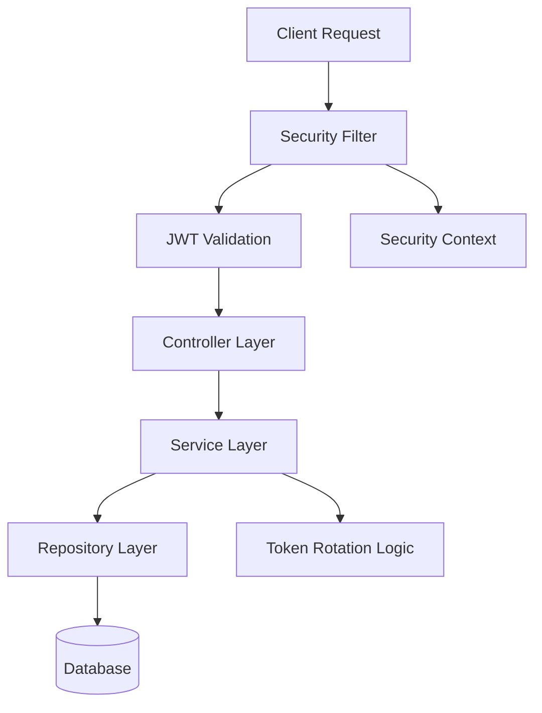
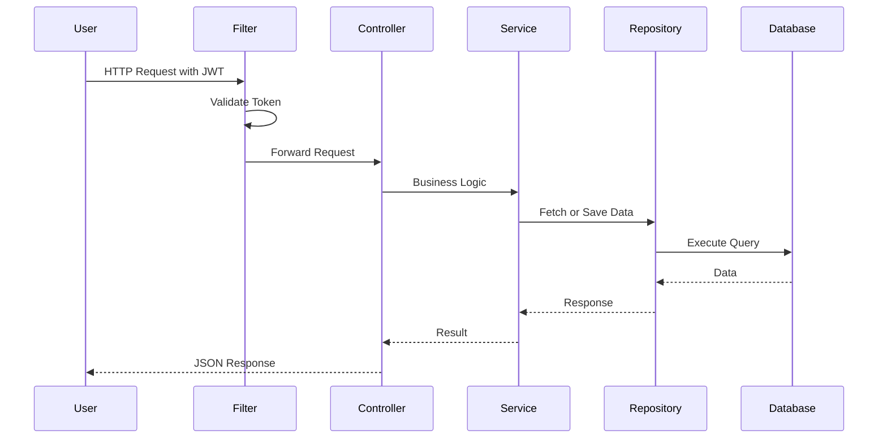
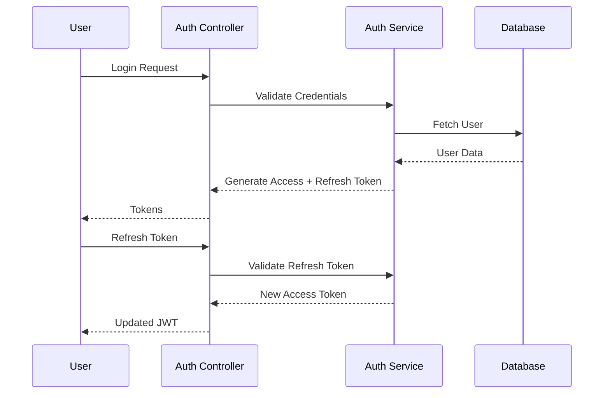
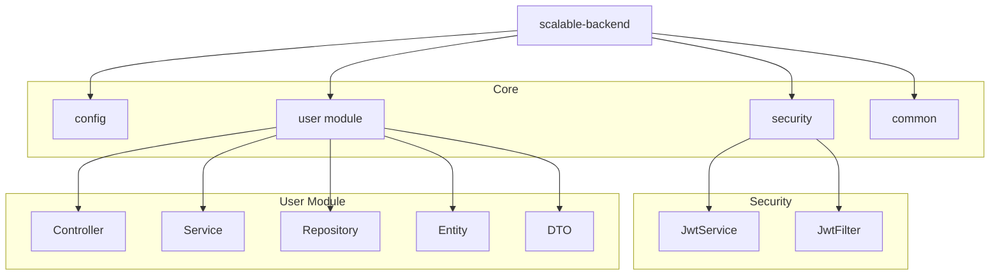

# Scalable Backend

A production-ready Spring Boot backend implementing stateless JWT authentication, role-based access control, refresh token rotation, and secure REST API design.

This project demonstrates clean architecture principles, domain-driven modular organization, and secure authentication flows suitable for modern distributed systems.

---

## Overview

This project demonstrates a scalable and secure backend architecture using Spring Boot.  
It follows industry-standard layering and stateless authentication practices suitable for modern REST APIs.

The system is designed with production-readiness in mind, including structured configuration, secure token handling, and clean dependency management.

---

## Core Features

- Stateless JWT Authentication (Access + Refresh Tokens)
- Role-Based Access Control (USER / ADMIN)
- Secure Filter Integration (OncePerRequestFilter)
- Refresh Token Rotation
- Logout with Token Invalidation
- Global Exception Handling
- DTO-based Response Structure
- OpenAPI (Swagger) API Documentation
- Environment-based Configuration
- Clean Layered Architecture

---

## System Architecture



---

## Request Flow



---

## Authentication Flow



---

## Design Principles

- Feature-first modular architecture  
- Clear separation of concerns  
- Stateless authentication  
- Scalable and maintainable structure  
- Production-oriented configuration  

---

## Project Structure (Visual)



---

## Tech Stack

- Java 21  
- Spring Boot  
- Spring Security  
- Spring Data JPA  
- PostgreSQL  
- JWT (jjwt)  
- OpenAPI (springdoc)  
- Maven  

---

## API Endpoints

| Method | Endpoint        | Description              |
|--------|----------------|--------------------------|
| POST   | /users         | Register new user        |
| POST   | /users/login   | Authenticate user        |
| POST   | /users/refresh | Refresh access token     |
| GET    | /users/me      | Get current user         |
| GET    | /users         | Get all users (Auth)     |
| GET    | /users/admin   | Admin-only endpoint      |
| POST   | /users/logout  | Logout user              |

---

## Configuration

Environment variables (recommended for production):

```env
DB_URL=jdbc:postgresql://localhost:5432/scalable_backend
DB_USER=postgres
DB_PASS=password
JWT_SECRET=your_secret_key
```

---

## Running Locally

### Using Maven Wrapper

```bash
./mvnw clean install
./mvnw spring-boot:run
```

### Or Build JAR

```bash
./mvnw clean package
java -jar target/scalable-backend-0.0.1-SNAPSHOT.jar
```

### Swagger UI

🔗 http://localhost:8080/swagger-ui/index.html

---

## Security Design

- Stateless REST architecture (no server sessions)  
- JWT access & refresh token mechanism  
- Role-based authorization (USER / ADMIN)  
- Token validation via custom filter  
- SecurityContext population per request  
- Password encryption using BCrypt  
- Endpoint-level access control  

---

## Future Enhancements

- Spring Boot Actuator monitoring  
- Distributed microservices architecture  
- API Gateway integration  
- Microservices split (Auth Service / User Service)  

---

## Author

**Rakesh Pedapudi**  
Backend Engineering · Secure API Design · Scalable Systems  

---

## License

This project is licensed under the **MIT License**.
